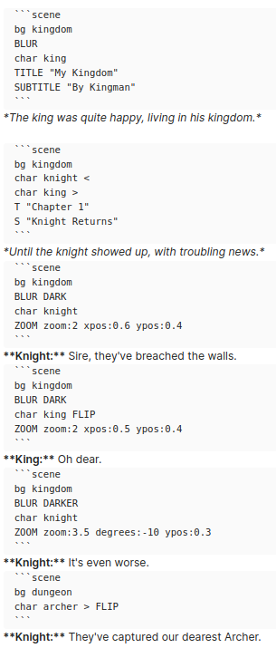
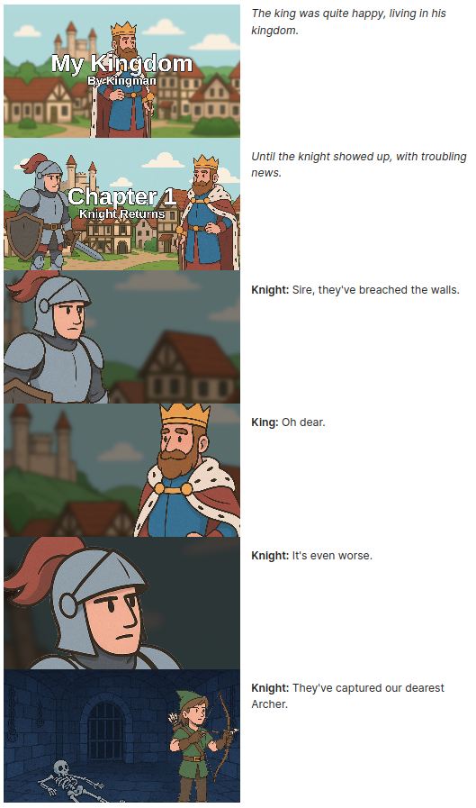
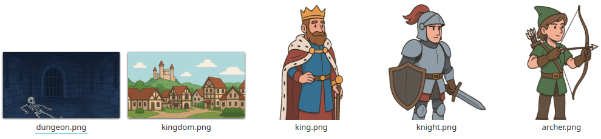

# Scenes v1.0
## About
Inspired by visual novel systems, easily stamp multiple images into a single scene.


|Code|Preview|
|:-:|:-:|
|||

All out of just a few assets.



Scenes can be a simple background and character.
```scene
bg home
char mary
```

Or advanced with text and filters.
```scene
bg battlefield
char archer <
char knight >
BLUR DARK
char king
TITLE "Kings Choice" ^
SUBTITLE "The Archer and Knight"
```

## Commands
Commands are space seperated arguments and keyword arguments (kwargs). "arg1 arg2 kwarg1:value kwarg2:value"

There are basically 3 kinds of commands: images, text, and effects.

### Images
Images must be in the `/gfx` folder of obsidian.

Arguments become the path so `bg home` -> `gfx/bg/home.png`

Supported image formats are: `.webp` `.png` `.jpg` `.jpeg`

By default an image starts in the bottom center.

|Args|Description|
|:---:|:---------:|
|`FLIP`|Flip texture from left to right.|
|`<`|Align to left.|
|`>`|Align to right.|
|`+`|Align to center.|

When you use `>` the image will be drawn flipped. If you don't want that add `FLIP`

### Text
There are two text commands:
```
TITLE or T
    desc: Large text. Defaults to center of the screen.
    args:
        First argument must be text wrapped in quotations.
        <: Align to left of screen.
        >: Align to right of screen.
        v: Align to bottom of screen.
        ^: Align to top of screen.
        (Combine arrows like < ^ for corner alignment.)

SUBTITLE or S
    desc: Small text displayed under the title, unless explicitly told where to render.
    args:
        First argument must be text wrapped in quotations.
```

The subtitle will automatically align under the title, unless explicitly given an alignment.

### Effects

```
BLUR
    desc: Applies blur filter to everything behind it.
        Use after background elements and before foreground elements.
    args:
        DARK: Brightness to 50%
        DARKER: Brightness to 25%
        LIGHT: Brightness to 150%
        LIGHTER: Brightness to 180%
        DESAT: Saturation to 50%.
        SAT: Saturation to 150%.
    kwargs:
        pixels:8

BLOOM
    desc: Applies bloom (Glowing light) to everything behind it.
    kwargs:
        pixels:8
        alpha:0.5

DARK
    desc: Darkens everything behind it.
    kwargs:
        amount:0.5 (Alpha.)

LIGHT
    desc: Lightens everything behind it.
    kwargs:
        amount:0.5 (Alpha.)

DESAT (todo)
SAT (todo)
TINT (todo)

ZOOM
    desc: Zooms the canvas and takes a snap shot.
        Elements draw later will not be zoomed.
    kwargs:
        zoom:2.0
        degrees:0.0 (Optional degrees to rotate the view.)
        xpos:0.5 (Where to move camera x. 0.0 = left most, 1.0 = right most.)
        ypos:0.5 (Where to move camera y. 0.0 = top most, 1.0 = bottom most.)

SEPIA
    kwargs:
        amount: 100 (Percentage sepia)

GRAY or GRAYSCALE
    kwargs:
        amount:100 (Percentage grayscale)

HUE
    desc: Shifts the color hue.
    kwargs:
        amount:90 (Degrees to shift color.)

INVERT
```

### Advanced
You can write multiple commands on the same line using `&` to join them.

```scene
bg home & char mary
T "Mary" & S "Monday At Home"
```

## Stage Sizes + Spoiler

|Codeblock Tag|Description|
|:-----------:|-----------|
|`stage`|50% of viewport.|
|`stage_full`|100% of viewport.|
|`stage_small`|33% of viewport.|

Adding `_right` or `_center` will align to right or center of content. Defaults to left.

Adding `_spoiler` to the end will make the stage blurred unless hovered with the mouse.
